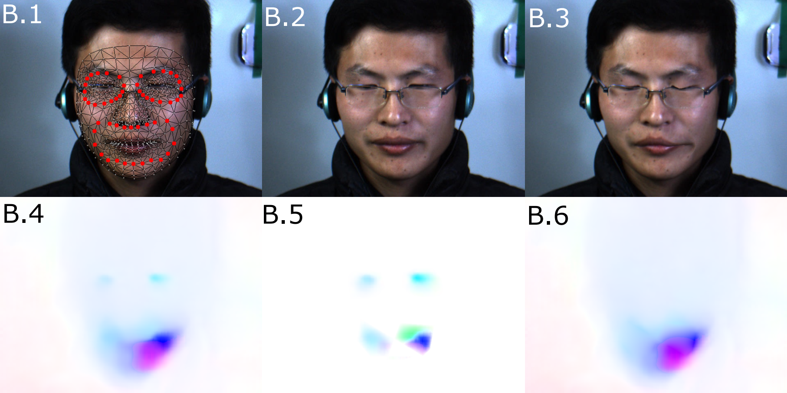

# Lagrangian Motion Magnification with on Faces with Facial Landmarks

The implementation of sparse PCA-based, selective motion magnification can be found [here](https://github.com/phflot/dsd_momag).



## Requirements

Setup anaconda via ```conda env create -f environment.yml```. To reproduce the demo recording, the file EP04_04f.avi from the CASME II microexpression dataset is required.

## Citation

If you use this code for your work, please cite
  
> P. Flotho, C. Heiss, G. Steidl, and D. J. Strauss, “Lagrangian Motion Magnification with Landmark-Prior and Sparse PCA for Facial Microexpressions and Micromovements,” in Annu Int Conf IEEE Eng Med Biol Soc, 2022.

BibTeX entry
```
@inproceedings{flotea2022b,
  author = {Flotho, P. and Heiss, C. and Steidl, G. and Strauss, D.J.},
  title = {Lagrangian Motion Magnification with Landmark-Prior and Sparse PCA for Facial Microexpressions and Micromovements (accepted)},
  booktitle = {Annu Int Conf IEEE Eng Med Biol Soc},
  year = {2022}
}
```